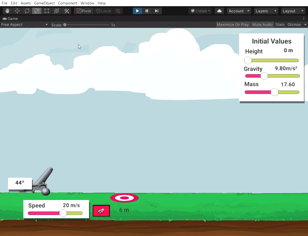

# Projectile Simulator

The Physics school project, Projectile Simulator provides user to learn more about the physics of the projection
and the importance of each elements in the Physics. It provides the learner with a user-friendly, virtual environment
for exploring variety of principles associated with projectile motion. This project was made on my Second Semester
of first year college,
in Computer Science

 